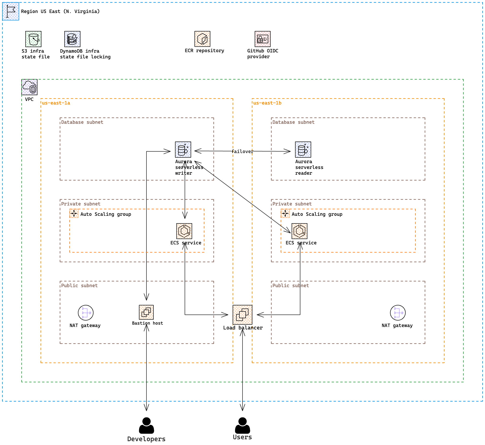

# Terraform Infrastructure Template Seed (TITS)


This is an official STRV infrastructure template written in [Terraform](https://www.terraform.io/). It's the alternative
to our [CDK](https://aws.amazon.com/cdk/) [template](https://github.com/strvcom/backend-template-devops).

## High level architecture
An image is worth a thousand words:


Are you interested in hands on experience? Jump right to the [setup](#setup)!
By the way, I thought [Brainboard](https://app.brainboard.co) is a great tool for drawing the Terraform architecture but
I changed my mind. I don't recommend using it unless you want all your hair to fall out. You can choose alternatives
such as [Excalidraw](https://excalidraw.com/) or old good [Draw.io](https://app.diagrams.net/).

The best practice is to [separate](https://docs.aws.amazon.com/whitepapers/latest/organizing-your-aws-environment/organizing-your-aws-environment.html)
environments on the account level. It comes out from the AWS [Well-Architected Framework](https://aws.amazon.com/architecture/well-architected/)
That's why there are three completely separated environments – `dev`, `stg`, and `prod` in the `environments` directory.
Each of them is a standalone environment with its state file so environments don't see each other.

⚠️ Price of this minimalistic infrastructure is around $6 per day.

⚠️ At STRV, there is a DevOps team. It's you 🥳. Although we follow the least privilege principle, when deploying, you
should have a role containing `AdministratorAccess` policy, whereas developers not working directly with infrastructure
but with AWS services should have a role containing `PowerUserAccess` policy. See job functions
[guide](https://docs.aws.amazon.com/IAM/latest/UserGuide/access_policies_job-functions.html).

## Modules
We follow the SoC [principle](https://en.wikipedia.org/wiki/Separation_of_concerns) even in this infrastructure template.
The template is fully modularized, which means there are just a few lines of code that are copy-pasted between
environments and the true logic is inside of each module. This gives us the absolute power of what should be deployed in each
environment since they are fully separated. It allows you to for example deploy a small database cluster with a cheap machine
on the dev whereas on prod is deployed a full-featured big serverless beast with a ton of ACU, which is able to survive even
the bigger load you can ever imagine.

Check out the README of all modules to get a basic understanding of what happens under the hood:
- [Common](modules/common/README.md) contains resources, which are needed probably for every project like ECR repository or
  OIDC role.
- [VPC](modules/vpc/README.md) contains all resources that are needed for fully-featured VPC like internet gateway, NAT
  gateways, routing tables, and many others.
- [Database](modules/database/README.md) contains database.
- [Service](modules/service/README.md) contains ECS cluster with a load balancer.
- [Remote Access](modules/remote-access/README.md) contains resources to allow access to private
  components like the database. Bastion host and VPN serve that purpose.

## Setup
The template contains four environments in total. A common environment that holds resources needed by the rest of the
environments and three workload environments. Although there are four environments, the initial setup process is the same
for all of them. When you finish with the S3 bucket and DynamoDB table for your state file, you need to first deploy the
common environment and then workload environments. These two processes differ a little bit.

### Steps required within all environments
First, create an S3 bucket which will hold Terraform state file. It can be done manually or using Terraform itself. [Here](https://strvcom.atlassian.net/wiki/spaces/BE/pages/1884618791/S3)
is a guide, how to deploy S3 bucket. I always create the bucket manually, which is my preferred way, but generally, it's up to you.
But don't forget to enable versioning! ⚠️ Since bucket names are globally unique, the good practice is to name them following
this format `<environment>-<bucket_name>-<account_id>-<region>`. In the case of this template, it can look like this
`dev-template-terraform-805382315593-us-east-1`. Now put the bucket name into the `versions.tf` file.

Optional part is to set up a DynamoDB table. When two developers would run `terraform apply` at the same time, there would
be very likely conflict and it would be a 💥. DynamoDB table serves as a locking mechanism to prevent it. If you find
the locking important (I recommend to set it up anyway), create a table with partition key `LockID`.
See the [guide](https://developer.hashicorp.com/terraform/language/settings/backends/s3) how to set up a Terraform backend
for more concrete information. The good practice is to name the table the same as the S3 bucket containing the state file.
To be the most cost-effective, don't create a table with the `Default settings`, but with the `Customize settings` option. This
allows you to choose the `DynamoDB Standard-IA` table class and `On-demand` capacity. ⚠️ This configuration is not recommended
for wide usage of DynamoDB tables, it's just the best option in terms of cost-effectiveness in this use case. Always study
pricing for your particular use case before setting up DynamoDB tables as this resource can be really costly! Don't forget
to also turn on the deletion protection.

Every resource should have appropriate tags to improve the maintainability of your cloud applications. This applies also
to the S3 bucket and DynamoDB table. Follow the `default_tags` section in the AWS provider at `versions.tf`. In other words,
when setting up bucket and table, don't forget to create tags `AppName=Go API template` and `Environment=dev` (just an example).

Required prerequisites for the following steps:
- You have an existing AWS account in our two STRV AWS accounts - `STRV DevOps Templates` and `STRV Playground`. If not,
  contact your manager.
- Configured AWS SSO, so Terraform is allowed to perform API operations.

### Common environment
A common environment is suitable for resources needed by all other environments. At this moment, there is an ECR repository and
OIDC role required by GitHub repository to be able to push Docker images. If you don't deploy ECR at first, deploying
of the ECS service in workload environments would fail because there is no Docker image to pull. ECR repository is shared
among all other AWS workload accounts so this is the central place to store them. This environment can be suitable also for
Route 53 hosted zones and other shared resources that are needed by the rest of your AWS accounts. Although the architecture
is modularized, there is no required order of module deployment. It's designed to deploy it all in a single step. Let's do it.

Terraform needs to be initialized. Set your working directory to `environments/common` and run:
```shell
terraform init
```
This creates a directory `.terraform` with all poviders and modules downloaded.

The next step is to deploy the whole common environment (don't forget to change values in `terraform.tfvars`):
```shell
terraform apply -var-file=terraform.tfvars
```

### Development environment
A development environment is probably the first one you want to deploy when a project started. At this point, you should have
already prepared the common environment. When you have Docker image in place (see the [guide](https://docs.aws.amazon.com/AmazonECR/latest/userguide/docker-push-ecr-image.html)),
you can proceed to deployment:

Steps are the same as [below](#common-environment). Set your working directory to `environments/dev` and run:
```shell
terraform init
terraform apply -var-file=terraform.tfvars
```

After the successful deployment, you see your output variables. The output might look like this:
```shell
database_cluster_endpoint = "go-api-template-postgres.cluster-chb4ficdk9sr.us-east-1.rds.amazonaws.com"
ecs_load_balancer_dns_name = "go-api-template-734507092.us-east-1.elb.amazonaws.com"
```

Try, if the API is working:
```shell
curl -v http://go-api-template-734507092.us-east-1.elb.amazonaws.com/ping
```
You should see 204 as a status code.

Check whether the API version is one you expect:
```shell
curl http://go-api-template-734507092.us-east-1.elb.amazonaws.com/version
```
You should see `{"version":"0.1.0"}` in the response.

Neither bastion host nor VPN are deployed by default. It is disabled in the config [file](environments/dev/terraform.tfvars).
If you want to deploy a component for remote access to private components, see the [guide](modules/remote-access/README.md).

If your IDE shows warnings in the modules that resources are not found locally, I recommend running:
```shell
terraform init -backend=false
```
in the module directory. This will locally download all dependencies and IDE intellisense will be working.

## CI/CD
Pipelines in `.github` directory are divided into two groups - workflows and custom actions. Relationship between them is
simple - custom actions are reusable components used inside workflows to simplify and DRY the pipeline code. From high
level, there are four workflows. Two (`fmt` and `validate`) for CI and two (`plan` and `apply`) for CD.

### Actions
`Setup Terraform` action is used by Terraform related workflows to download the Terraform CLI binary. This is also
the place to update the Terraform version (`TF_VERSION` env variable). By default is installed also a wrapper script to wrap
subsequent calls of the terraform binary and expose its stdout, stderr, and exit code. The action uses cache, which is
important regarding Terraform providers. AWS provider binary has almost 400 MiB in size. The template currently contains 8
`.terraform` directories so having initialized all environments and modules can take a lot of disk space. There is a
[guide](https://developer.hashicorp.com/terraform/cli/config/config-file#provider-plugin-cache) on how to use the plugin cache.
In case of this action, providers are cached centrally in `/home/runner/.terraform.d/plugin-cache` so any subsequent
Terraform init operation doesn't have to download provider binaries all over again but creates just a symlink. Output
variable `plugin-cache-dir` is exposed so workflows can set Terraform env variable `TF_PLUGIN_CACHE_DIR` accordingly.

`For Each Env` action is useful in situations where a Terraform operation is supposed to be run for each
environment (dev, stg, prod). Operation is accepted as the input variable from a calling workflow. It works in a way where
an operation is performed in each subdirectory (environment) of the environments directory. This action wouldn't make any
sense if the `.terraform` directory wouldn't be cached. `.terraform` contains all important files needed by Terraform to plan
or apply deployments. There are `stdout`, `stderr`, and `exitcode` output variables, which are handy for other external
tools or actions.

`For Env` action behaves exactly the same as `For Each Env` but it accepts one more input - `env`, so the action knows from
which directory to perform an operation instead of performing it within each environment.

`For Each Module` action is useful in situations where a Terraform operation is supposed to be run for each module. It works
exactly in the same way as `For Each Env` except the operation is run within all subdirectories of the `modules` directory.

`Setup EasyRSA` action is used by VPN related workflows to download EasyRSA CLI binary. [EasyRSA](https://github.com/OpenVPN/easy-rsa)
is a utility to build and manage a PKI CA ([public key infrastructure](https://en.wikipedia.org/wiki/Public_key_infrastructure)).
In laymen's terms, this means to create a root certificate authority, and request and sign certificates, including sub-CAs
and certificate revocation lists (CRL). This is also the place to update EasyRSA version (`EASYRSA_VERSION` env variable).
There is no caching because binary has just a few KiB, it's stored by GitHub itself, and VPN related workflows are run very rarely.

### Workflows
`lint` workflow is run on a pull request commit or on merging to the master. After initial steps like checking out a repository
and setting up the Terraform and TFLint, there is a need to initialize Terraform. That's why the `For Each Env` and
`For Each Module` actions with the `init` operation are run. The first one is for environments and the second for modules.
However, there is one trick - the `init` operation is run with `-backend=false`, which means all module files are downloaded
but the backend (state file) is not initialized. It means there is no need to log in to AWS - linting of Terraform files
is a local operation. The first linting step is code formatting. Formatter runs in a check mode, that's why it just reports
an unformatted code instead of instant formatting it. Another linting step is code validation. The validate step is run in
the `For Each Env` action. The last step is TFLint, which can run recursively from the project root the same way as the
formatter.

`plan` workflow can be triggered only manually because the deployment process can be a stresful operation, especially
when deploying on the production. The intention is to have the whole process under full control. The one who deploys needs
to see what is going to be deployed - no blind deployments allowed. A developer never knows what could have happened in
the infrastructure (unexpected manual interventions). That's why it's important to see a diff of what is deployed and what
the state file after deploying will look like. The workflow accepts `env` input - an environment to plan for a deployment.
After checking out a repository, there is a special step, where workflow logins to the AWS account. By login is meant assuming
a specified role that has admin rights. After this step, Terraform can be set up with initializing - backend included. The plan
command needs to download the current state file from the S3 bucket, that's why the backend needs to be set up. The `plan` step
itself is run in the `For Env` action because it is allowed to deploy only one environment in a workflow. In this case, command
line input is disabled to ensure all needed data are taken from a particular var file. Plan output is stored in a file,
instead of printing it in the command line. The last step is uploading the generated state file as an artifact for the purpose
of the actual deployment. Unlike `fmt` and `validate` workflows, the result of the plan command cannot be sent as a PR comment,
because when triggering a manual workflow, it's without a pull request context, since the workflow is run on a branch, not
on a pull request. That's why the finished workflow has to be opened to see a result. However, there is a space for a Slack
bot to improve the developer experience.

`apply` workflow is the second part of the deployment process. The workflow can be triggered only manually for the same
reasons mentioned above in the `plan` section. The workflow accepts `env` and `plan_workflow_id` inputs. `env` input serves
the same purpose as in the `plan` workflow. The `plan_workflow_id` input is the ID of the completed `plan` workflow. `apply`
needs to know the workflow ID so it can download the artifact from the `plan` workflow. The first steps are the same as in `plan`
workflow - checking out a repository, logging to AWS, and setting up Terraform. The next step is to download the artifact
containing the `plan` output from the workflow identified by `plan_workflow_id`. There is a safeguard mechanism in the form
of the environment - if `plan` was performed for the dev environment but the `apply` accidentally for the stg environment, the plan
output file won't be found so the workflow will fail instead of unwanted deployment. The last step is Terraform apply. It just
applies the downloaded plan output file in the correct environment (directory) specified by the input variable.

`create-vpn-client-cert` workflow serves for creating a new VPN client certificate. This workflow is supposed to be run every time an
infra maintainer wants to create VPN access for a new team member. The workflow can be triggered only manually. Although
creating the VPN configuration and deployment itself is a maintainer's manual step, maintaining certificates should not be.
PKI is stored centrally in GitHub, so there could happen unfortunate file overwrites by several infra admins. It's a good
practice to let this critical security operation on the CI and let it push a result directly into the master. The workflow
accepts `client_name` input, which is the base for generated file names (e.g. `jozko-dlouhy` -> `jozko-dlouhy.crt`). After
checking out a repository, and setting up EasyRSA, the client certificate is generated using the Makefile command. The last
step is automated Git commit & push of generated files (public certificate, private key, certificate request, ...). The
workflow can (should) be run on the master branch.

`revoke-vpn-client-cert` workflow serves for revoking of already existing VPN client certificate. This workflow is supposed
to be run every time an infra maintainer wants to revoke VPN access for a user. The workflow can be triggered only manually
for the same reasons mentioned above in the `create-vpn-client-cert` section. The workflow accepts `env` and `client_name`
inputs. `env` describes the environment where the VPN is deployed. `client_name` has to match with `create-vpn-client-cert`.
When creating certificate for `jozko-dlouhy`, the same client name has to be provided when revoking the access. After checking
out a repository, and setting up EasyRSA, the client certificate is revoked using the Makefile command. The last step is
automated Git commit & push of revoked files (revoked, crl.pem, ...). The workflow can (should) be run on the master branch.

### Setup
In GitHub, go to Settings -> Environments and create the same environments you already have in AWS. In this case, it's
dev, stg, and prod (dev is sufficient if you are just playing with stones). In each environment, create environment
secret `AWS_ACCOUNT_ID` with the appropriate value. Then create environment variable `AWS_REGION` with value `us-east-1`,
which is the region STRV always deploys to. Workflows won't be running correctly (at least `plan` and `apply`) without
deploying the common module, where is OIDC role. The command how to do it is mentioned above.

### How To Deploy
There are two ways how to run manual workflows. The first one is via GitHub website in Actions tab. The second way is a
GitHub CLI [tool](https://cli.github.com/). As described above, the deployment process consists of two phases - planning
and applying so two workflows need to run. In the dev environment, it is expected to test and deploy resources manually
via a user's terminal. When a new Terraform code is tested and ready to deploy on another environment (stg), create a PR and
wait for `fmt` and `validate` workflows to succeed. Then manually trigger the `plan` workflow in the GitHub website or CLI:
```shell
gh workflow run plan -f env=stg
```

Check out the plan result in the completed workflow. If everything seems to be as expected, run the `apply` workflow either
via website or CLI:
```shell
gh workflow run apply -f env=stg -f plan_workflow_id=<plan_workflow_id>
```

`plan_workflow_id` can be obtained either from the URL path when opening the `plan` workflow detail page or with CLI:
```shell
gh run list --workflow plan.yaml
```

Check the `apply` workflow result if everything ended up correctly.

## Maintainers
- Tomáš Kocman ([GitHub](https://github.com/TomasKocman), `@tomaskocman` on Slack)

## TO-DOs
- Deploy one DB `db.t3.medium` instance instead of two serverless instances on dev ($0.082 per hour per instance vs $0.12 per ACU).
- Automatic deployments to dev env.
- Research SAML based VPN so we could possibly get rid of mutual authentication.
- Set up alarms.
- pki
  - Find a better way how to maintain pki.
  - Create a separate CA for each env.
  - Document CA rotation (when anyone with read access to this repo leaves the project or company).
- Migrate to IPv6 wherever possible.
- Improve developer experience by creating a Slack bot.
